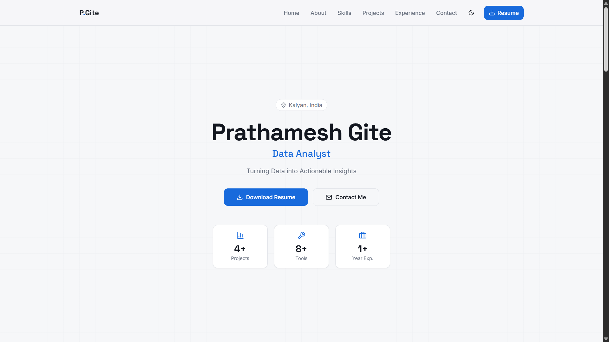

# 📊 Prathamesh Gite – Data Analyst Portfolio

## 🚀 Live Preview



### 🚀 Live Portfolio: https://prathameshgite-da.vercel.app

---

## 💡 About

This is my personal **Data Analyst Portfolio Website** showcasing my projects, skills, and experience in data analysis.

I specialize in transforming raw data into **meaningful insights** using tools like Python, SQL, and Power BI.

---

## 🎯 Features

- 📊 Data-focused project showcase  
- 📈 Interactive dashboard-style UI  
- 🌙 Light & Dark mode  
- 📱 Fully responsive design  
- 📬 Contact form integration  
- ⚡ Fast and modern UI  

---

## 🛠️ Tech Stack

- **Frontend:** React.js, Tailwind CSS  
- **Data Tools:** Python (Pandas, NumPy), SQL, Power BI  
- **Tools:** Git, GitHub, Vercel  

---

## 📁 Projects Highlighted

### 🔹 Netflix Data Analysis
- Analyzed 8,800+ records  
- Identified trends in content, genres, and countries  
- Built Power BI dashboard for insights  

---

### 🔹 Titanic Survival Analysis
- Performed data cleaning & EDA  
- Found survival patterns using multiple variables  
- Visualized insights with dashboards  

---

### 🔹 Customer Complaints Analysis
- Identified top complaint categories  
- Analyzed city-wise complaint distribution  
- Designed KPI-based dashboard  

---

### 🔹 Fraud Detection Analysis *(In Progress)*
- Working on identifying anomalies in transaction data  
- Focus on pattern recognition and insights  

---

## 📌 Experience

**Software Engineer – Lionbridge Technologies**  
- Worked on data validation, quality analysis, and reporting  
- Supported AI/ML data pipelines  

---

## 🎓 Education

**B.Sc. in Information Technology**  
University of Mumbai (2020 – 2023)

---

## 📬 Contact

- 🌐 Portfolio: https://prathameshgite-da.vercel.app  
- 💼 LinkedIn: https://www.linkedin.com/in/prathamesh-gite-927949383  
- 💻 GitHub: https://github.com/Pratham1514  

---

## ⚡ Installation (For Developers)

```bash
git clone https://github.com/Pratham1514/data-insights-hub.git
cd data-insights-hub
npm install
npm run dev
